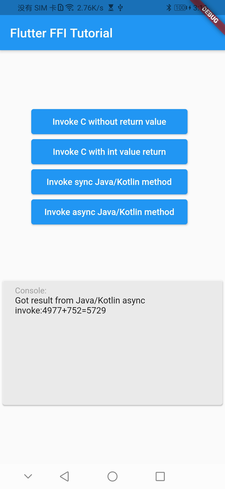

# flutter_ffi_tutorial

A demo project that implements Flutter FFI synchronization and asynchronous methods.
Only implemented on Android platfrom.

- Invoke C without return value

- Invoke C with int value return

- Invoke sync Java/Kotlin method

- Invoke async Java/Kotlin method

## Snapshot

## Requirements

- Flutter 1.17.5+ / Dart 2.10+

## Usage

Below Flutter 2.0 you'd change the [dart_version.h](https://github.com/VomPom/flutter_ffi_tutorial/blob/main/android/src/main/jni/internal/dart_version.h) DART_API_DL_MAJOR_VERSION to 1, Otherwise, the asynchronous callback cannot be executed.

Check out [example](https://github.com/VomPom/flutter_ffi_tutorial/tree/main/example).
